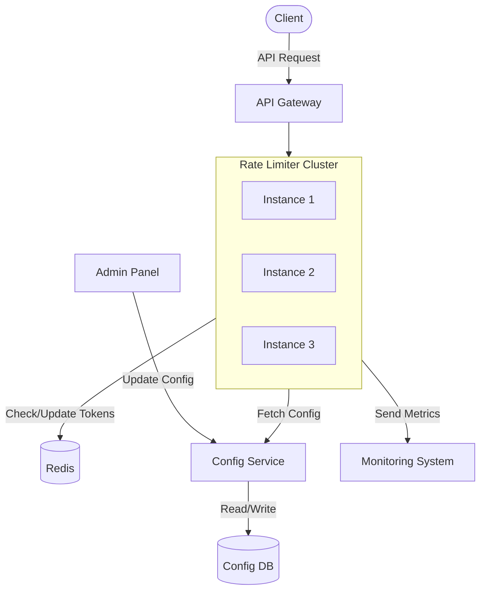
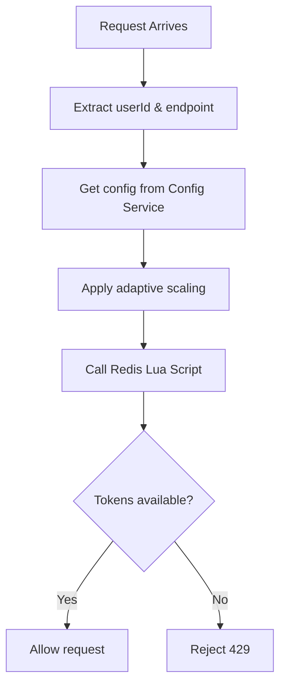
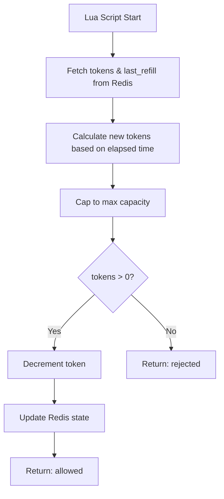
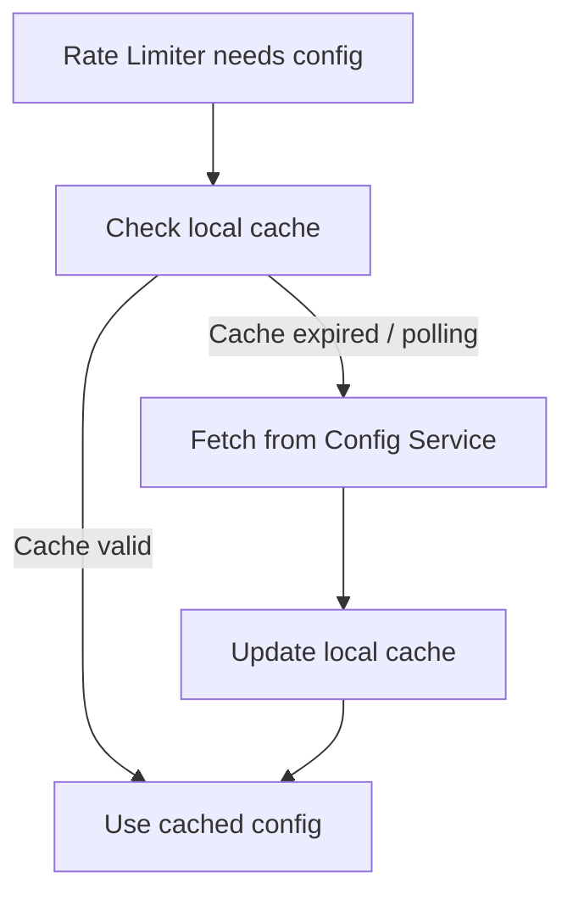
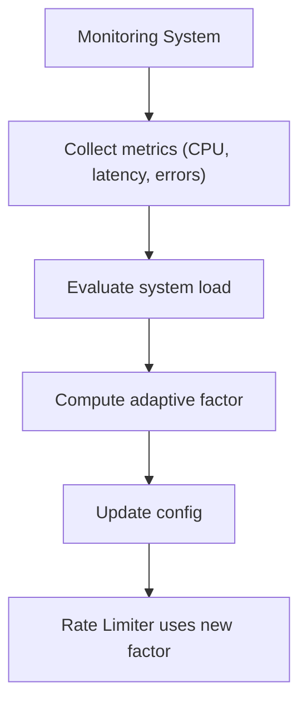

# Distributed Adaptive Rate Limiter

A production-style, real-time rate limiting project built with **Node.js**, **TypeScript**, **Redis**, and **Express**. It uses the **Token Bucket algorithm** executed atomically via **Redis Lua scripting**, with an **adaptive throttling engine** that dynamically adjusts rate limits based on live system health metrics.

## Quick Start (Docker)

```bash
docker compose up
```

- App: [http://localhost:3000](http://localhost:3000)
- Admin dashboard: [http://localhost:3000/admin](http://localhost:3000/admin)
- Health: [http://localhost:3000/health](http://localhost:3000/health)

Try a request:

```bash
curl -H "x-api-key: demo-pro-key" http://localhost:3000/test
```

---

## Why This Project?

Every API at scale needs rate limiting. Without it, a single misbehaving client can bring down the entire service. But most rate limiters are static — they blindly enforce fixed limits regardless of whether the server is idle or on fire.

This project goes further. It builds a rate limiter that **adapts in real time**: when the server is under stress (high CPU, high latency, elevated error rates), it automatically tightens limits to protect the system. When conditions improve, it gradually restores them. This is the same approach used by infrastructure teams at companies like AWS, Cloudflare, and Stripe.

**Key problems it solves:**
- **Traffic spikes** — Token bucket allows controlled bursts while enforcing sustained throughput limits
- **Distributed state** — Redis ensures consistent rate limiting across multiple server instances
- **Race conditions** — Lua scripting makes token checks and updates atomic, even under high concurrency
- **Tiered access** — Different user tiers (free/pro/enterprise) get different limits, with per-endpoint overrides for sensitive routes like login
- **System protection** — Adaptive throttling acts as a safety valve, reducing traffic before the server crashes
- **Fairness under load** — Enterprise users are protected with higher minimum limits, while free-tier absorbs the most reduction

---

## Tech Stack

| Technology | Role |
|------------|------|
| **Node.js + TypeScript** | Runtime & type safety |
| **Express** | HTTP server & middleware pipeline |
| **Redis** | Distributed token bucket state store |
| **ioredis** | Redis client with retry & reconnection |
| **Lua scripting** | Atomic token bucket operations inside Redis |
| **Tailwind CSS (CDN)** | Admin dashboard styling |

---

## Architecture Overview

### High-Level Design (HLD)



> **How it connects:** Requests hit the API Gateway, which routes them to stateless Rate Limiter instances. Each instance checks/updates tokens in Redis (shared state), fetches dynamic configs, and sends metrics to the monitoring system. The Admin Panel updates configs in real time.

### Component Definitions

| # | Component | Role |
|---|-----------|------|
| 1 | **Client** | Sends API requests with a `user_id` / API key. Can generate burst or normal traffic. |
| 2 | **API Gateway** | Entry point — handles auth, routing, and extracts user + endpoint. Forwards request to a rate limiter instance. |
| 3 | **Rate Limiter Service (Cluster)** | Stateless instances that apply token bucket + adaptive logic. Fetch config, check/update Redis, return allow/reject. |
| 4 | **Redis** | Stores tokens and last refill timestamps per user/endpoint. Uses atomic ops (Lua scripts) to avoid race conditions. The demo uses a single Redis instance; it can be adapted to Redis Cluster. |
| 5 | **Config Service** | Provides dynamic rate limits per user tier and endpoint. Updates instantly without restarting the rate limiter. |
| 6 | **Config DB** | Stores persistent configs like user plans and limits. Config service reads/writes from here. *(In our demo: in-memory Map)* |
| 7 | **Monitoring System** | Collects metrics: request rate, blocked count, latency, CPU, memory. Feeds data for adaptive throttling decisions. |
| 8 | **Admin Panel** | UI to update rate limits and user tiers in real time. Triggers config changes via the config service. |

**End-to-End Flow (short):**
> Client → Gateway → Rate Limiter → Redis + Config → Decision → Allow (forward) / Reject (429)

---

## How It Works

### Token Bucket Algorithm

Each user gets a separate token bucket **per endpoint** in Redis. The bucket:
- Starts **full** (e.g., 5 tokens for free tier)
- **Drains** by 1 token per request
- **Refills** at a steady rate (e.g., 1 token/second for free tier)
- Cannot exceed its **capacity** (no hoarding)

This allows **bursts** (use all 5 tokens instantly) while enforcing a **sustained rate** (1 request/second after the burst). The entire check-and-update runs as a single **Lua script inside Redis**, making it atomic — no race conditions even with thousands of concurrent requests.

**Redis key pattern:** `rate_limit:{userId}:{matchedEndpoint}` where `matchedEndpoint` is an exact/segment-aware override like `/api/login`, or `default` for tier defaults.

### Tiered Rate Limiting

| Tier | Capacity | Refill Rate | Login Limit |
|------|----------|-------------|-------------|
| Free | 5 tokens | 1/sec | 3 tokens, 0.5/sec |
| Pro | 50 tokens | 10/sec | 20 tokens, 5/sec |
| Enterprise | 500 tokens | 100/sec | 100 tokens, 30/sec |

Each tier supports **endpoint-specific overrides** — sensitive routes like `/api/login` get stricter limits to prevent brute-force attacks.

### Adaptive Throttling

A background process evaluates system health every 5 seconds and adjusts a global **adaptive factor** (0.0 – 1.0):

| Condition | Action |
|-----------|--------|
| CPU > 80% **or** Latency > 500ms **or** Error rate > 10% | Reduce factor by 5% |
| CPU < 40% (and no other issues) | Increase factor by 5% |
| CPU between 40-80% (and no issues) | Hold steady |

The factor scales all rate limits: at factor 0.5, a free user's capacity drops from 5 → 2. But each tier has a **minimum factor floor** — enterprise never drops below 80% of their limits, ensuring paying customers are protected.

### Fail-Open Design

If Redis goes down, the rate limiter **allows all requests through** rather than blocking everything. A broken rate limiter should never take down the entire API.

### IETF Standard Headers

Every response includes standard rate limit headers:
```
X-RateLimit-Limit: 5          ← max tokens
X-RateLimit-Remaining: 3      ← tokens left
X-RateLimit-Reset: 2          ← seconds until full
Retry-After: 1                ← (only on 429) seconds until next token
```

---

## Project Structure

```
rate-limiter/
├── src/
│   ├── server.ts                            # Entry point — starts Redis, metrics, adaptive, Express
│   ├── app.ts                               # Express app — middleware pipeline & route wiring
│   │
│   ├── types/
│   │   └── index.ts                         # All TypeScript interfaces & types
│   │
│   ├── config/
│   │   ├── defaults.ts                      # Default tier configs & adaptive thresholds
│   │   ├── configService.ts                 # In-memory config store — tier rules, adaptive config
│   │   ├── userService.ts                   # User → tier mapping (demo: in-memory)
│   │   └── validation.ts                    # Input validation — rule parsing, userId sanitization
│   │
│   ├── core/
│   │   ├── logger.ts                        # Structured logger (console-based)
│   │   └── redis/
│   │       ├── client.ts                    # ioredis client with retry strategy
│   │       └── scripts.ts                   # Token Bucket Lua script — loaded once, called via EVALSHA
│   │
│   ├── middleware/
│   │   ├── identity.ts                      # User resolution — API key lookup, x-user-id fallback
│   │   └── rateLimiterMiddleware.ts         # Express middleware — extracts user, checks limit, sets headers
│   │
│   ├── modules/
│   │   ├── rateLimiter/
│   │   │   └── rateLimiter.ts               # Core logic — config lookup, adaptive scaling, Redis call
│   │   ├── monitoring/
│   │   │   └── metricsCollector.ts          # Rolling window metrics — CPU, memory, latency, RPS
│   │   ├── adaptive/
│   │   │   └── adaptiveThrottler.ts         # Background evaluator — adjusts factor based on health
│   │   └── admin/
│   │       ├── adminRoutes.ts               # REST API — CRUD for tiers, users, adaptive config, metrics
│   │       └── healthRoute.ts               # GET /health — Redis ping, uptime, adaptive factor
│   │
│   └── tests/
│       └── core.test.ts                     # Unit tests — config, validation, endpoint matching
│
├── public/
│   └── index.html                           # Admin dashboard — live metrics, tier editor, burst tester
│
├── load-test/
│   ├── steady.js                            # k6 — constant 100 VUs for 30s
│   ├── stress-ramp.js                       # k6 — ramp from 100 to 1000 VUs
│   └── tier-mix.js                          # k6 — concurrent free + pro tier traffic
│
├── .github/workflows/ci.yml                 # GitHub Actions — typecheck + test with Redis service
├── Dockerfile                               # Multi-stage build (build → production)
├── docker-compose.yml                       # App + Redis with healthcheck
├── .env.example                             # Environment variable template
├── package.json
└── tsconfig.json
```

---

## Flow Diagrams

### Rate Limiter Internal Flow



### Redis Token Bucket Flow



### Config Service Flow



### Adaptive Rate Limiting Flow



---

## Admin Dashboard

A real-time monitoring dashboard accessible at `/admin`:

- **Live Metrics** — RPS, blocked requests, avg latency, CPU, memory, adaptive factor (polls every 2s)
- **Tier Configuration** — View and edit rate limits for all tiers at runtime
- **User Management** — Assign users to tiers, add/remove users
- **Adaptive Config** — Tune CPU/latency/error thresholds and adjustment step
- **Quick Test Panel** — Send burst requests (1, 5, 20, or custom count) to test rate limiting in real time

---

## API Reference

### Demo Endpoints (Rate Limited)

| Method | Endpoint | Description |
|--------|----------|-------------|
| GET | `/test` | Simple test endpoint |
| GET | `/api/data` | Sample data endpoint |
| POST | `/api/login` | Login endpoint (stricter limits) |

### Admin API

| Method | Endpoint | Description |
|--------|----------|-------------|
| GET | `/api/admin/config/tiers` | Get all tier configs |
| GET | `/api/admin/config/tiers/:tier` | Get specific tier config |
| PUT | `/api/admin/config/tiers/:tier` | Update tier config |
| GET | `/api/admin/config/adaptive` | Get adaptive config + current factor |
| PUT | `/api/admin/config/adaptive` | Update adaptive thresholds |
| GET | `/api/admin/users` | List all users and their tiers |
| PUT | `/api/admin/users/:userId` | Set user tier |
| DELETE | `/api/admin/users/:userId` | Remove user |
| GET | `/api/admin/metrics` | Get current system metrics |

### Health Check

| Method | Endpoint | Description |
|--------|----------|-------------|
| GET | `/health` | Server health, Redis status, uptime (bypasses rate limiter) |

---

## Design Decisions

| Decision | Why |
|----------|-----|
| **Token Bucket over Sliding Window** | Allows natural bursts while enforcing sustained rates — more closely models real API usage patterns |
| **Lua scripting over Node.js logic** | Atomic execution inside Redis — eliminates race conditions without distributed locks |
| **EVALSHA over EVAL** | Script is loaded once, called by hash — saves ~460 bytes of network traffic per request |
| **Per-user-per-rule buckets** | Requests use the matched override key or the tier default key, preventing path-variant bypasses like `/api/loginhistory` |
| **In-memory config (Map)** | O(1) lookups on every request — a database call would add 5-50ms of latency per request |
| **Fail-open on Redis failure** | A broken rate limiter shouldn't take down the entire API — availability over strictness |
| **Separate server errors from 429s** | Rate limit blocks (429) are intentional — only real server failures (5xx) should trigger adaptive throttling |
| **Tier minimum factors** | Enterprise users paid for reliability — their limits should never drop as aggressively as free-tier |
| **Dead zone (40-80% CPU)** | Prevents factor oscillation — without it, the system would constantly flip between increase/decrease |
| **Gradual 5% adjustment step** | Smooth transitions prevent thundering herd — instant large changes cause traffic oscillation |

---

## Edge Cases & Solutions

| # | Edge Case | Problem | Solution |
|---|-----------|---------|----------|
| 1 | **Redis Failure** | Rate limiter can't read/write token data — may block all requests | Fail-open strategy: allow requests temporarily, log errors for recovery |
| 2 | **Race Conditions** | Concurrent requests read same token count — limit exceeded incorrectly | Redis Lua scripts execute atomically — correct updates guaranteed |
| 3 | **Hot Keys (High Traffic Users)** | Single user/API key gets huge traffic — Redis bottleneck on one key | Could be addressed via key sharding (hash-suffix partitioning) to distribute load across multiple Redis keys |
| 4 | **Burst Traffic Spikes** | Sudden spike of requests can overload the system | Token bucket allows limited bursts + adaptive throttling reduces limits during high load |
| 5 | **Config Service Failure** | Cannot fetch latest rate limits — system may malfunction | Cached configs + default fallback values ensure continued operation |
| 6 | **Clock Synchronization** | Different server times cause incorrect token refill calculations | Use consistent time source (Redis server time / `Date.now()` per instance) |
| 7 | **Memory Growth in Redis** | Inactive users' keys accumulate — memory waste | TTL (60s expiry) on keys auto-cleans unused data |
| 8 | **Over-Throttling (Bad UX)** | Users get too many 429 errors — poor experience | Return `Retry-After` header and allow small bursts for smoother usage |
| 9 | **Network Latency / Redis Delay** | Slow Redis calls increase request latency | Efficient Lua scripts + minimal round trips + local config caching |

---

## Problems Faced During Development

### 1. Adaptive Death Spiral

When users exceeded their rate limit, the system returned 429 (Too Many Requests). But these blocked responses were being **counted as errors** in the metrics collector — inflating the `errorRate`. The adaptive throttler saw the high error rate and **reduced rate limits further**, causing even more 429s, which caused even higher error rates... and the system spiraled down until limits hit the absolute minimum.

- **Root cause:** `recordRequest(blocked=true)` incremented the same counter used for `errorRate`
- **Symptom:** Free tier limit dropped from 5 → 1 after a single burst test
- **Fix:** Separated `blockedRequests` (intentional 429s) from `serverErrors` (actual failures like Redis crashes)
- **Result:** `errorRate` now only reflects real server failures — rate limiting works without triggering adaptive throttling

### 2. Redis Lua Float Truncation

The Lua script returned `refill_rate` back to Node.js so it could calculate `Retry-After` headers. But Redis Lua **truncates floats to integers** on return — so a `refill_rate` of `0.5` (free tier login) came back as `0`. This caused `Math.ceil(1 / 0) = Infinity`, and the `Retry-After` header was set to `Infinity`.

- **Root cause:** Redis protocol converts Lua `number` returns to integers — `0.5` becomes `0`
- **Symptom:** `Retry-After: Infinity` in 429 responses for endpoints with sub-1 refill rates
- **Fix:** Used the TypeScript-side `scaledRule.refillRate` (which preserves decimals) instead of the Redis return value
- **Result:** Correct `Retry-After` headers for all tiers and endpoints

---
## Performance

Benchmarked using k6 against a single-node deployment (Node.js + Redis) running locally through Docker.

| Scenario | Throughput | Avg Latency | p50 | p95 | p99 | Error Rate |
|----------|------------|-------------|-----|-----|-----|-----------|
| Steady Load (100 VUs, 30s) | 1,395.89 req/s | 71.32ms | 67.51ms | 96.05ms | 126.26ms | 0.00% |
| Tier Mix (30 free + 200 pro req/s) | 230.04 req/s | 2.44ms | 2.39ms | 3.63ms | <10ms | 0.00% |
| Stress Ramp (100 → 1000 VUs) | Completed Successfully | Stable Under Load | See Results | See Results | See Results | 0.00% |

### Key Results

- Sustained ~1.4k requests/sec under a constant 100 concurrent-user workload.
- Maintained sub-100ms p95 latency during steady-state operation.
- Achieved 0% failed requests across benchmark scenarios.
- Redis-backed Lua token bucket operations remained stable under concurrent access.
- Tier-based throttling correctly differentiated free and pro traffic profiles.
- Adaptive throttling remained operational during high-concurrency stress testing.

### Load Test Scenarios

#### Steady Load

- 100 Virtual Users
- 30-second duration
- Constant concurrent traffic
- Validates latency, throughput, and Redis stability under sustained load

#### Tier Mix

- Concurrent free-tier and pro-tier traffic
- Validates tier isolation and differentiated rate limits
- Confirms correct enforcement of per-tier policies

#### Stress Ramp

- Gradual ramp from 100 to 1000 virtual users
- Validates scaling behavior and adaptive throttling response
- Confirms system stability under increasing concurrency

Raw benchmark outputs are available in the `results/` directory.

## Known Limitations & Future Work

- **Config & users are in-memory** - admin API edits are lost on restart, and multiple instances diverge. Production version would persist to Redis with pub/sub invalidation.
- **Adaptive factor is per-process** - under uneven load, two nodes may compute different factors. Could be centralized in Redis.
- **Single-region only** - no replication/failover for the Redis dependency.
- **No structured logging** - current logger is console.log; production would use pino/winston with JSON output.

---

## Running Locally

### Prerequisites

- **Node.js** (v18+)
- **Redis** (v6+) — running on localhost:6379

### 1. Clone the repository

```bash
git clone https://github.com/shivaiitp/Adaptive-Rate-Limiter.git
cd rate-limiter
```

### 2. Install dependencies

```bash
npm install
```

### 3. Configure environment

Create a `.env` file in the root. You can start from `.env.example`:

```env
PORT=3000
REDIS_HOST=127.0.0.1
REDIS_PORT=6379
# Required for admin API access. Set to a long random string in production.
ADMIN_API_KEY=change-me
# When true, requests must include x-api-key. Recommended.
REQUIRE_API_KEY=true
```

### 4. Start Redis

If using Windows with WSL:
```bash
wsl sudo service redis-server start
```

Or on macOS/Linux:
```bash
redis-server
```

### 5. Start the development server

```bash
npm run dev
```

Useful scripts:

```bash
npm run build      # compile TypeScript into dist/
npm run start      # run the compiled server
npm run typecheck  # type-check without emitting files
npm test           # build and run the Node test suite
```

You should see:
```
Redis connected
Lua script loaded: <sha-hash>
Metrics collection started (every 5000ms)
Adaptive throttling started (every 5000ms)
Server running on port 3000
```

### 6. Open the dashboard

Navigate to [http://localhost:3000/admin](http://localhost:3000/admin) to access the admin dashboard.

### 7. Test it out

**Using the dashboard:** Use the Quick Test panel to send burst requests with different users and endpoints.

**Using curl:**
```bash
# Single request as free-tier user
curl -H "x-api-key: demo-free-key" http://localhost:3000/test

# If REQUIRE_API_KEY=false, x-user-id is also supported
curl -H "x-user-id: demo-free" http://localhost:3000/test

# Burst 10 requests (some will get 429)
for i in {1..10}; do curl -s -o /dev/null -w "%{http_code}\n" -H "x-api-key: demo-free-key" http://localhost:3000/test; done

# Enterprise user (500 token capacity)
curl -H "x-api-key: demo-enterprise-key" http://localhost:3000/test

# Check rate limit headers
curl -v -H "x-api-key: demo-free-key" http://localhost:3000/test 2>&1 | grep -i "x-ratelimit\|retry-after"
```

**Pre-seeded demo users:** `demo-free`, `demo-pro`, `demo-enterprise`

**Pre-seeded demo API keys:** `demo-free-key`, `demo-pro-key`, `demo-enterprise-key`

---

## License

Apache License 2.0 — see [LICENSE](LICENSE) for details.
