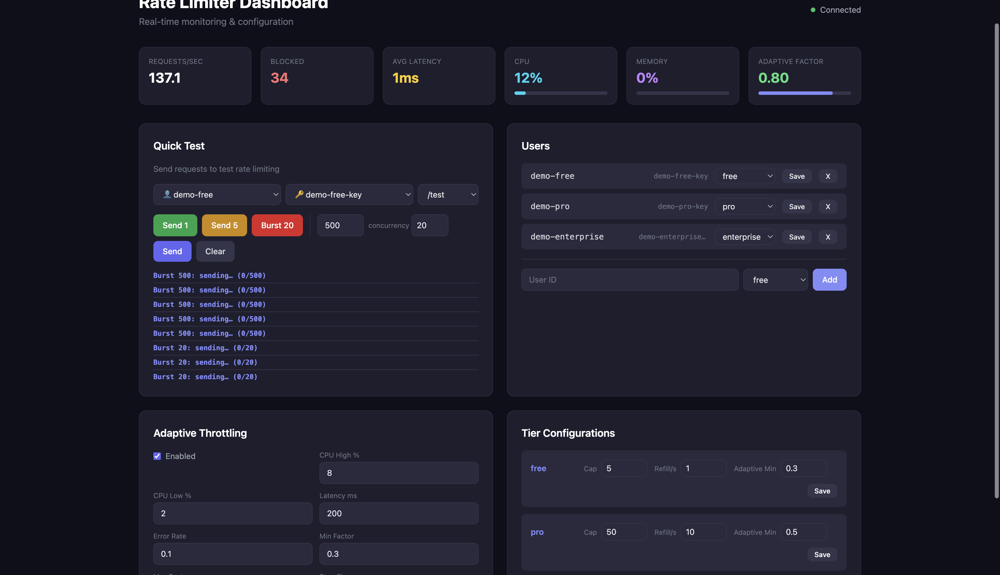
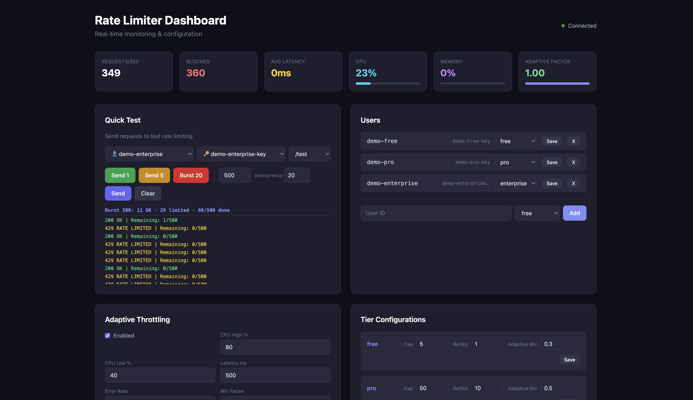
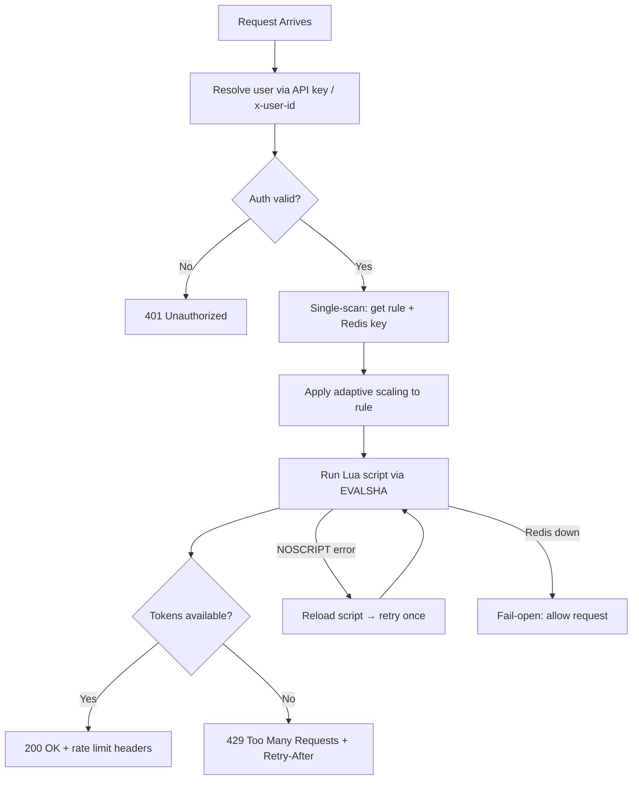
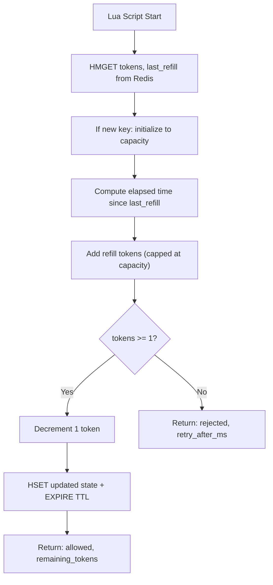
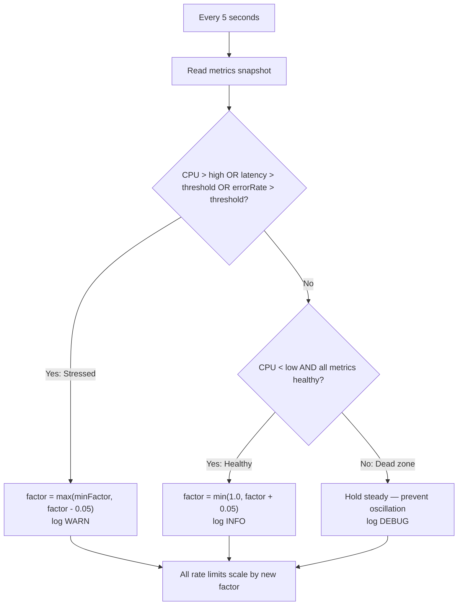

# Distributed Adaptive Rate Limiter

> A production-grade API rate limiter built with **Node.js**, **TypeScript**, **Redis**, and **Express** — featuring a **Token Bucket algorithm** executed atomically via **Redis Lua scripting**, an **adaptive throttling engine** that auto-adjusts limits based on live system health, and a real-time admin dashboard.

[](https://www.typescriptlang.org/)
[](https://nodejs.org/)
[](https://redis.io/)
[](https://www.docker.com/)
[](LICENSE)

---

## Live Demo

| Resource | URL |
|----------|-----|
| Admin Dashboard | `http://localhost:3000/admin` |
| Health Check | `http://localhost:3000/health` |
| Demo API | `http://localhost:3000/test` |

---

## Screenshots

### Admin Dashboard — Real-time Monitoring



*Live metrics panel showing requests/sec, blocked count, avg latency, process CPU, memory, and the adaptive factor updating in real time.*

### Burst Test in Action — 500 Requests, Results Stream Live



*Quick Test panel firing 500 requests at `demo-enterprise` user. Results stream in immediately as each response arrives (concurrency-limited to 20 in-flight). The enterprise user's 500-token bucket exhausts quickly, then subsequent requests receive `429 RATE LIMITED`.*

---

## Quick Start

```bash
# Clone and start with Docker (Redis included)
git clone https://github.com/shivaiitp/Adaptive-Rate-Limiter.git
cd Adaptive-Rate-Limiter
docker compose up
```

Open the dashboard: **[http://localhost:3000/admin](http://localhost:3000/admin)**

Test it immediately:
```bash
# Free tier (5-token bucket, 1 token/sec refill)
curl -H "x-api-key: demo-free-key" http://localhost:3000/test

# Pro tier (50-token bucket, 10 tokens/sec refill)
curl -H "x-api-key: demo-pro-key" http://localhost:3000/test

# Enterprise tier (500-token bucket, 100 tokens/sec refill)
curl -H "x-api-key: demo-enterprise-key" http://localhost:3000/test
```

---

## Why This Project?

Every API at scale needs rate limiting. But most rate limiters are **static** — they blindly enforce fixed limits regardless of whether the server is idle or overwhelmed.

This project goes further. It builds a rate limiter that **adapts in real time**: when the server is under stress (high CPU, high latency, elevated error rates), it automatically tightens limits to protect the system. When conditions improve, it gradually restores them. This is the same pattern used by infrastructure teams at companies like **AWS, Cloudflare, and Stripe**.

### Problems it solves

| Problem | Solution |
|---------|----------|
| **Traffic spikes** | Token bucket allows controlled bursts while enforcing sustained throughput |
| **Race conditions under concurrency** | Redis Lua scripts execute atomically — no distributed locks needed |
| **Distributed state across instances** | Redis stores all token buckets — stateless app servers |
| **Tiered access fairness** | Free/Pro/Enterprise tiers with per-endpoint overrides |
| **System overload protection** | Adaptive throttling reduces limits before the server crashes |
| **Redis script cache eviction** | NOSCRIPT storm prevention — concurrent reloads are deduplicated |
| **Fail safety** | Fail-open design — Redis failure never blocks all traffic |

---

## Tech Stack

| Technology | Role |
|------------|------|
| **Node.js + TypeScript** | Runtime & end-to-end type safety |
| **Express** | HTTP server & middleware pipeline |
| **Redis** | Distributed token bucket state — shared across all instances |
| **ioredis** | Redis client with retry strategy & reconnection logic |
| **Lua scripting (EVALSHA)** | Atomic token bucket check-and-update inside Redis |
| **Docker + Docker Compose** | Containerized deployment with Redis healthcheck |
| **GitHub Actions** | CI pipeline — typecheck + tests on every push |

---

## Architecture

### High-Level Design

```mermaid
graph TD
    Client["Client"] -->|API Request| GW["API Gateway"]

    GW --> Cluster

    subgraph Cluster["Rate Limiter Cluster (stateless)"]
        I1["Instance 1"]
        I2["Instance 2"]
        I3["Instance 3"]
    end

    Cluster -->|Atomic check/update via Lua| Redis["Redis - Token Buckets"]
    Cluster -->|O(1) lookup| Config["Config Service - Tier Rules"]
    Cluster -->|Rolling window metrics| Monitor["Metrics Collector"]

    Monitor --> Adaptive["Adaptive Throttler"]
    Adaptive -->|Update factor| Cluster

    Admin["Admin Dashboard"] -->|REST API| Config
    Admin -->|View metrics| Monitor
```

> Requests hit stateless Rate Limiter instances that share state only through Redis. The Admin Dashboard updates configs at runtime without restarting anything.

### Component Definitions

| # | Component | Role |
|---|-----------|------|
| 1 | **Client** | Sends requests with an API key (`x-api-key`) or user ID (`x-user-id`) |
| 2 | **API Gateway** | Entry point — auth, routing, user resolution |
| 3 | **Rate Limiter Cluster** | Stateless instances — config lookup, adaptive scaling, Redis Lua call |
| 4 | **Redis** | Stores token count + last refill timestamp per `userId:endpoint`. Lua scripts make updates atomic |
| 5 | **Config Service** | In-memory `Map` — O(1) rule lookups per request, zero DB calls on the hot path |
| 6 | **Metrics Collector** | Rolling window counters (RPS, blocked, latency, errors). Uses `process.cpuUsage()` for accurate Node.js CPU measurement |
| 7 | **Adaptive Throttler** | Background evaluator — reads metrics every 5s, adjusts global factor |
| 8 | **Admin Dashboard** | Single-page UI at `/admin` — live metrics, tier editor, burst tester |

---

## How It Works

### 1. Token Bucket Algorithm

Each user gets a separate bucket **per endpoint** stored as a Redis hash:

```
rate_limit:{userId}:{matchedEndpoint}
  tokens      → current token count (float)
  last_refill → last update timestamp (ms)
```

- Starts **full** (e.g., 50 tokens for Pro tier)
- **Drains** 1 token per request
- **Refills** continuously at a steady rate (e.g., 10 tokens/sec for Pro)
- Cannot exceed its **capacity** — no token hoarding

This allows **bursts** (fire 50 requests instantly) while enforcing a **sustained rate** (10 requests/second after the burst). The entire check-and-update is a single **Lua script inside Redis** — atomic by design, no distributed locks required.

### 2. Tiered Rate Limiting

| Tier | Default Capacity | Default Refill | Login Capacity | Login Refill |
|------|-----------------|----------------|----------------|--------------|
| Free | 5 tokens | 1 token/sec | 3 tokens | 0.5/sec |
| Pro | 50 tokens | 10 tokens/sec | 20 tokens | 5/sec |
| Enterprise | 500 tokens | 100 tokens/sec | 100 tokens | 30/sec |

Each tier supports **endpoint-specific overrides** — `/api/login` gets stricter limits to prevent brute-force attacks while `/test` uses the tier default.

### 3. Adaptive Throttling

A background process evaluates system health every 5 seconds and adjusts a global **adaptive factor** (0.0–1.0) that scales all limits:

| Condition | Action |
|-----------|--------|
| CPU > 80% **or** Latency > 500ms **or** Error rate > 10% | Decrease factor by 5% (`warn` log) |
| CPU < 40% **and** latency **and** errors healthy | Increase factor by 5% (`info` log) |
| Neither (dead zone 40–80% CPU) | Hold steady — prevents oscillation (`debug` log) |

At factor `0.5`, a Pro user's capacity drops from 50 → 25. Each tier has a **minimum factor floor** — Enterprise never drops below 80% of their limits, protecting paying customers even under peak load.

### 4. Fail-Open Design

If Redis is unavailable, the rate limiter **allows all requests through** rather than blocking everything. A broken rate limiter should never take down the entire API. Infrastructure errors are tracked separately from 429s so they don't trigger adaptive throttling.

### 5. IETF-Standard Rate Limit Headers

Every response carries standard headers clients can act on:

```
X-RateLimit-Limit: 50         ← max tokens (your tier capacity)
X-RateLimit-Remaining: 43     ← tokens left in current bucket
X-RateLimit-Reset: 1          ← seconds until bucket is full
Retry-After: 1                ← (429 only) seconds until next token available
```

---

## Project Structure

```
rate-limiter/
├── src/
│   ├── server.ts                        # Entry point — Redis, metrics, adaptive, Express startup
│   ├── app.ts                           # Express app — middleware pipeline & route wiring
│   │
│   ├── types/
│   │   └── index.ts                     # All TypeScript interfaces & types
│   │
│   ├── config/
│   │   ├── defaults.ts                  # Default tier configs & adaptive thresholds
│   │   ├── configService.ts             # In-memory tier config store — O(1) lookups via Map
│   │   ├── userService.ts               # User → tier + API key mapping
│   │   └── validation.ts                # Input validation — rule parsing, userId sanitization
│   │
│   ├── core/
│   │   ├── logger.ts                    # Structured logger — JSON (prod) / human-readable (dev)
│   │   └── redis/
│   │       ├── client.ts                # ioredis client — REDIS_URL / REDIS_HOST+PORT auto-detect
│   │       └── scripts.ts               # Token Bucket Lua script — EVALSHA with NOSCRIPT recovery
│   │
│   ├── middleware/
│   │   ├── identity.ts                  # User resolution — API key lookup, x-user-id fallback
│   │   └── rateLimiterMiddleware.ts     # Core middleware — extract user, check limit, set headers
│   │
│   ├── modules/
│   │   ├── rateLimiter/
│   │   │   └── rateLimiter.ts           # Single-scan config lookup, adaptive scaling, Redis call
│   │   ├── monitoring/
│   │   │   └── metricsCollector.ts      # Rolling window — process CPU, heap memory, latency, RPS
│   │   ├── adaptive/
│   │   │   └── adaptiveThrottler.ts     # Background evaluator — stress/healthy/dead-zone logic
│   │   └── admin/
│   │       ├── adminRoutes.ts           # REST Admin API — CRUD for tiers, users, adaptive config
│   │       └── healthRoute.ts           # GET /health — Redis ping, uptime, adaptive factor
│   │
│   └── tests/
│       └── core.test.ts                 # Unit tests — config, validation, endpoint matching
│
├── public/
│   └── index.html                       # Admin SPA — live metrics, tier editor, burst tester
│
├── load-test/
│   ├── steady.js                        # k6 — constant 100 VUs for 30s
│   ├── stress-ramp.js                   # k6 — ramp from 100 to 1000 VUs
│   └── tier-mix.js                      # k6 — concurrent free + pro tier traffic
│
├── resources/                           # Dashboard screenshots
├── results/                             # Raw k6 benchmark outputs
├── .github/workflows/ci.yml             # GitHub Actions — typecheck + tests with Redis service
├── Dockerfile                           # Multi-stage build (build → production)
├── docker-compose.yml                   # App + Redis with healthcheck
└── .env.example                         # Environment variable template
```

---

## Flow Diagrams

### Request Flow



### Token Bucket (Lua Script)



### Adaptive Throttling Loop



---

## Key Engineering Decisions

| Decision | Rationale |
|----------|-----------|
| **Token Bucket over Fixed Window** | Allows natural bursts while enforcing sustained rates — matches real API usage better than hard resets |
| **Lua scripting over Node.js logic** | Atomic execution inside Redis eliminates race conditions without distributed locks |
| **EVALSHA over EVAL** | Script loaded once by hash — saves ~460 bytes of bandwidth per request at scale |
| **Single config scan per request** | `getRuleAndKey()` does one `endpoints.find()` returning both the rule and Redis key — avoids double iteration |
| **`process.cpuUsage()` over `os.cpus()`** | Measures this Node.js process, not the whole machine — adaptive throttling reacts to actual app load |
| **In-memory Map for config** | O(1) lookups — a DB call would add 5–50ms of latency on every request |
| **NOSCRIPT storm prevention** | Concurrent `loadScripts()` calls share one inflight Promise — prevents 40+ parallel reloads on Redis restart |
| **Separate error types** | 429s (intentional) never increment `errorRate` — only real 5xx failures trigger adaptive throttling |
| **Dead zone (40–80% CPU)** | Prevents factor oscillation — without it, the system constantly flips between increase/decrease |
| **Fail-open on Redis failure** | A broken rate limiter should never take down the entire API |
| **Tier minimum factor floors** | Enterprise users never drop below 80% of their limits — paying customers get reliability guarantees |

---

## Edge Cases & Solutions

| # | Edge Case | Solution |
|---|-----------|----------|
| 1 | **Redis failure** | Fail-open: allow requests, log infra errors separately from 429s |
| 2 | **Race conditions** | Lua script is atomic inside Redis — no two requests can read the same token count |
| 3 | **NOSCRIPT storm** | Single inflight `loadScripts()` Promise shared by all concurrent reloads |
| 4 | **Float truncation in Lua** | `refill_rate` removed from Lua return; `retryAfterMs` calculated in Lua using integer-safe math |
| 5 | **Clock drift across instances** | Each instance uses its own `Date.now()` — small skews only affect refill delta, not correctness |
| 6 | **Hot keys (viral users)** | Can be addressed with key sharding (hash-suffix partitioning) across multiple Redis nodes |
| 7 | **Memory growth in Redis** | TTL auto-expires inactive buckets after `2 × (capacity / refillRate)` seconds |
| 8 | **Config service failure** | In-memory Map never fails; default fallback rule (5/1) applied if tier is missing |
| 9 | **Over-throttling UX** | `Retry-After` header tells clients exactly when to retry; burst allowance smooths usage |
| 10 | **Adaptive death spiral** | Blocked 429s excluded from `errorRate` — rate limiting doesn't trigger further throttling |

---

## Performance Benchmarks

Benchmarked with [k6](https://k6.io/) against a single-node Docker deployment (Node.js + Redis) on local hardware.

| Scenario | Throughput | Avg Latency | p50 | p95 | p99 | Error Rate |
|----------|------------|-------------|-----|-----|-----|------------|
| **Steady Load** (100 VUs, 30s) | **1,395.89 req/s** | 71.32ms | 67.51ms | 96.05ms | 126.26ms | **0.00%** |
| **Tier Mix** (30 free + 200 pro VUs) | 230.04 req/s | 2.44ms | 2.39ms | 3.63ms | <10ms | **0.00%** |
| **Stress Ramp** (100 → 1000 VUs) | Stable | — | — | See `results/` | — | **0.00%** |

### Key Results

- Sustained **~1,400 req/s** under 100 concurrent users
- Sub-100ms p95 latency during steady-state operation
- **0% failed requests** across all benchmark scenarios
- Redis Lua token bucket remained stable under full concurrency
- Tier isolation correctly differentiated free vs. pro traffic profiles
- Adaptive throttling stayed operational throughout stress ramp

Raw k6 outputs: [`results/`](results/)

---

## Problems Solved During Development

### 1. Adaptive Death Spiral

**Problem:** 429 responses were counted as `serverErrors` in metrics. The adaptive throttler saw a high error rate → reduced limits → more 429s → higher error rate → limits hit the floor. The system throttled itself to zero.

**Root cause:** `recordRequest(blocked=true)` incremented the same counter as real server failures.

**Fix:** Separated `blockedRequests` (intentional 429s) from `serverErrors` (actual 5xx failures). Only real failures trigger adaptive throttling.

---

### 2. Redis Float Truncation → `Retry-After: Infinity`

**Problem:** The Lua script returned `refill_rate` to Node.js for `Retry-After` calculation. Redis Lua truncates floats to integers on return — `0.5` (free-tier login refill rate) came back as `0`. `Math.ceil(1 / 0) = Infinity`.

**Fix:** Removed `refill_rate` from the Lua return entirely. `retry_after_ms` is now calculated inside Lua using integer-safe math. Node.js uses the TypeScript-side `scaledRule.refillRate` (which preserves decimals) for all header math.

---

### 3. NOSCRIPT Storm Under Concurrency

**Problem:** After a Redis restart, the Lua script cache is cleared. Every concurrent request hit `NOSCRIPT`, then called `loadScripts()` simultaneously — resulting in 40+ parallel reloads, each acquiring a new SHA and logging "Lua script loaded".

**Fix:** `loadScripts()` itself now checks and reuses an inflight `Promise`. All concurrent callers share one reload attempt. A `tokenBucketScriptSha = undefined` invalidation before reload ensures the new SHA is always fetched after recovery.

---

## API Reference

### Demo Endpoints (Rate Limited)

| Method | Endpoint | Description |
|--------|----------|-------------|
| GET | `/test` | Basic test endpoint |
| GET | `/api/data` | Sample data response |
| POST | `/api/login` | Login (stricter per-tier limits) |

### Admin API (requires `x-admin-api-key` header)

| Method | Endpoint | Description |
|--------|----------|-------------|
| GET | `/api/admin/config/tiers` | Get all tier configurations |
| GET | `/api/admin/config/tiers/:tier` | Get specific tier config |
| PUT | `/api/admin/config/tiers/:tier` | Update tier limits at runtime |
| GET | `/api/admin/config/adaptive` | Get adaptive config + current factor |
| PUT | `/api/admin/config/adaptive` | Update adaptive thresholds |
| GET | `/api/admin/users` | List all users with their tier and API key |
| PUT | `/api/admin/users/:userId` | Create/update user → auto-generates API key |
| DELETE | `/api/admin/users/:userId` | Remove user |
| GET | `/api/admin/metrics` | Current system metrics snapshot |
| GET | `/health` | Redis ping, uptime, adaptive factor (bypasses rate limiter) |

---

## Running Locally

### With Docker (recommended)

```bash
git clone https://github.com/shivaiitp/Adaptive-Rate-Limiter.git
cd Adaptive-Rate-Limiter
docker compose up
```

### Without Docker

**Prerequisites:** Node.js 18+, Redis 6+

```bash
# 1. Install dependencies
npm install

# 2. Configure environment
cp .env.example .env
# Edit .env — set ADMIN_API_KEY and REDIS_HOST/PORT (or REDIS_URL)

# 3. Start Redis
# Windows (WSL):
wsl sudo service redis-server start
# macOS/Linux:
redis-server

# 4. Start dev server
npm run dev
```

**Useful scripts:**

```bash
npm run dev        # ts-node-dev with hot reload
npm run build      # compile TypeScript → dist/
npm run start      # run compiled server
npm run typecheck  # type-check without emitting
npm test           # run unit tests
```

### Pre-seeded demo credentials

| User | API Key | Tier |
|------|---------|------|
| `demo-free` | `demo-free-key` | Free (5 tokens, 1/sec) |
| `demo-pro` | `demo-pro-key` | Pro (50 tokens, 10/sec) |
| `demo-enterprise` | `demo-enterprise-key` | Enterprise (500 tokens, 100/sec) |

### Test with curl

```bash
# Single request
curl -H "x-api-key: demo-free-key" http://localhost:3000/test

# Burst 10 requests — watch the 429s kick in
for i in {1..10}; do
  curl -s -o /dev/null -w "%{http_code}\n" -H "x-api-key: demo-free-key" http://localhost:3000/test
done

# Check rate limit headers
curl -v -H "x-api-key: demo-pro-key" http://localhost:3000/test 2>&1 | grep -i "x-ratelimit\|retry-after"

# Health check
curl http://localhost:3000/health
```

---

## Environment Variables

| Variable | Default | Description |
|----------|---------|-------------|
| `PORT` | `3000` | HTTP server port |
| `REDIS_URL` | — | Full Redis connection string (Railway, Render, Heroku) |
| `REDIS_HOST` | `127.0.0.1` | Redis host (used if `REDIS_URL` not set) |
| `REDIS_PORT` | `6379` | Redis port (used if `REDIS_URL` not set) |
| `ADMIN_API_KEY` | — | Secret key for admin API access |
| `REQUIRE_API_KEY` | `false` | Require `x-api-key` on all requests |
| `LOG_LEVEL` | `debug` (dev) / `info` (prod) | Minimum log level |
| `NODE_ENV` | `development` | `production` enables JSON log output |

---

## Known Limitations & Future Work

- **Config & users are in-memory** — admin API edits are lost on restart. Production would persist to Redis with pub/sub invalidation across instances.
- **Adaptive factor is per-process** — under uneven load, two nodes may compute different factors. A production version would centralize the factor in Redis.
- **Single-region** — no Redis replication or failover. Production would use Redis Sentinel or Cluster.
- **API keys are deterministic** — keys follow `userId-tier-key` pattern (fine for demo). Production would use `crypto.randomBytes(32)` with SHA-256 hash storage.

---

## License

Apache License 2.0 — see [LICENSE](LICENSE) for details.
